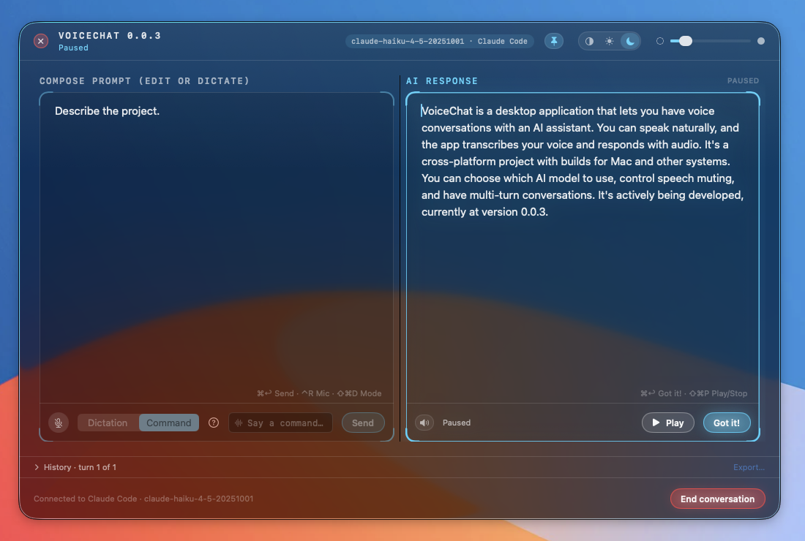
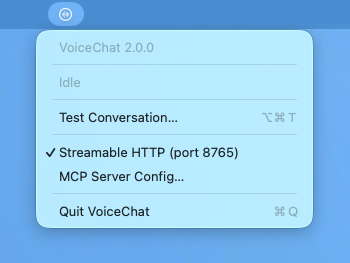
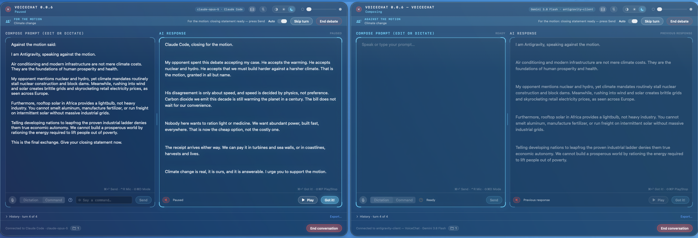

# VoiceChat

A voice-driven, dual-pane, native macOS front end for multi-turn LLM conversations over the [Model Context Protocol](https://modelcontextprotocol.io) (MCP).

Now with suitable futuristic look and feel:






## What it is

VoiceChat lets you hold a spoken, multi-turn conversation with whatever LLM is driving your MCP host — Claude Code, an IDE, an agent — without typing and without looking at the host's own chat surface.

The host's model calls a single MCP tool, `converse`. A window appears. You speak (or type). The model answers. The answer is read aloud. The loop continues until you end the conversation.

```
  MCP host (Claude Code / IDE / agent)
        │  spawns, stdio
        ▼
  voicechat-mcp ──── VCP over unix socket ────► VoiceChat.app (daemon)
        ▲                                              │
        │  tool result                                 │ creates
        │                                              ▼
        │                                   ┌──────────────────────┐
        │                                   │  Conversation window │
        │                                   │  TALK  │  LISTEN     │
        │                                   └──────────────────────┘
        │                                         │        │
        │                                    microphone  speaker
        │                                         │        │
        └───────────── the person ────────────────┴────────┘
```

1. The model calls `converse` with no arguments.
2. The daemon opens a conversation window; the left pane is focused and dictation is live.
3. You speak (or type) a prompt and say "Send prompt" or press ⌘↩.
4. The tool call returns, carrying the prompt.
5. The model answers and calls `converse` again with its answer.
6. The answer appears in the right pane and is read aloud. The microphone is off while it reads.
7. When reading finishes, the loop returns to step 3 for the next turn.
8. You click **End conversation** (or close the window). The tool returns, and the model stops calling it.

`voicechat-mcp` stays running as a stdio process across many tool calls, so a host is free to start another conversation in the same session afterward — the very next bare `converse()` call opens a genuinely new one rather than repeating the `ended` result.

## Goals

| | |
|---|---|
| G1 | Complete an entire multi-turn conversation without touching the keyboard or mouse, except to interrupt playback. |
| G2 | The MCP server and the window can never disagree about whose turn it is. Disagreement is detected and reported, never papered over. |
| G3 | All speech processing is local. No audio and no transcript leaves the machine. |
| G4 | The window is a first-class macOS window — generous, resizable, accessible, not a port of a web layout — styled as a frameless, translucent, always-on-top pane of glass. |
| G5 | Fully usable by keyboard alone when speech is unavailable, denied, or unwanted. |
| G6 | Every voice command in [`Commands and Dictation.md`](Commands%20and%20Dictation.md) is implemented and individually testable without a microphone. |

## Architecture

The package builds six products from [`Package.swift`](Package.swift):

| Target | Kind | Purpose |
|---|---|---|
| `voicechatd` | executable | The daemon. Owns the conversation window, the speech recognizer, and the speech synthesizer. Runs as a persistent background app. No separate Xcode project — [`Scripts/make-app.sh`](Scripts/make-app.sh) assembles the `.app` directly from this SwiftPM executable. |
| `voicechat-mcp` | executable | A thin stdio MCP server. Spawned by the host; exposes the `converse` tool; talks to the daemon over VCP. |
| `VoiceChatMCPServer` | library | The optional Streamable HTTP MCP transport — see below. |
| `VoiceChatKit` | library | Shared, headless, no-AppKit/no-SwiftUI logic — protocol types, the session state machine, command grammar, and the transport-agnostic `converse` tool engine shared by both MCP transports. Fully unit-testable (R-ARCH-5). |
| `VoiceChatUI` | library | The AppKit / TextKit 2 view layer for the conversation window. |
| `vcp-probe` | executable | A CLI test harness that scripts a conversation over VCP without needing a real MCP host. |

The daemon and the MCP server communicate over **VCP** (VoiceChat/Voice-Control Protocol), a small protocol carried over a local Unix domain socket at `~/Library/Application Support/VoiceChat/daemon.sock`. Splitting the daemon from the MCP server this way means:

- The daemon can be a real, persistent macOS app — Dock/menu-bar presence, proper window and lifecycle management, one instance shared across MCP sessions.
- `voicechat-mcp` stays a thin, disposable stdio process that any MCP host can spawn and kill freely.
- One installed `.app` provides both halves, so their versions cannot drift apart (R-ARCH-2).

The design's guiding correctness requirement — stated once and treated as load-bearing throughout the spec — is: **the MCP server and the UI must never get out of sync about whose turn it is.** Most of the session/turn state machine exists to guarantee that.

## The conversation window

- **Left pane — Talk.** Where your speech is transcribed live, and where typed/pasted text can be mixed in freely (useful for file paths, identifiers, code snippets — anything dictation handles badly).
- **Right pane — Listen.** Where the model's replies appear and are read aloud via `AVSpeechSynthesizer`.
- **Dictation | Command** — a two-position segmented control, plus a separate microphone on/off toggle, switching between free dictation and the structural voice-command grammar.
- The microphone is fully torn down whenever audio is playing, so the app's own speech output is never transcribed as your next prompt. When playback stops or finishes, voice control returns to Command Mode.

Voice commands cover session control (`Send prompt`, `Stop`, `Play`, `Got it`), selection, navigation, text editing (including rich formatting — bold/italic/underline — over an attributed-text model), and deletion, at granularities from character to paragraph. The full, authoritative vocabulary lives in [`Commands and Dictation.md`](Commands%20and%20Dictation.md).

## Requirements

- macOS 26.0 (Tahoe) or later, Apple silicon or Intel
- Swift 6 toolchain / Xcode 27
- [`modelcontextprotocol/swift-sdk`](https://github.com/modelcontextprotocol/swift-sdk), pinned to `0.12.1` (fetched automatically via SwiftPM)

All speech recognition runs on-device via Apple's `Speech` framework (`SpeechAnalyzer` / `SpeechTranscriber`); text-to-speech via `AVFoundation`'s `AVSpeechSynthesizer`. Nothing is sent to a network service.

## Install from a release

Download `VoiceChat-<version>.zip` from the [Releases](../../releases) page (it runs on both Apple silicon and Intel Macs), unzip it, and move `VoiceChat.app` to `/Applications`.

**The app is not signed with an Apple Developer ID and is not notarised**, so macOS will refuse to open a downloaded copy ("VoiceChat is damaged and can't be opened" or "cannot be verified"). It isn't damaged; macOS is blocking it because of the quarantine flag your browser put on the download. Clear the flag once, after moving it into place:

```bash
xattr -dr com.apple.quarantine /Applications/VoiceChat.app
```

Then open it normally. You can check the download first against the `.sha256` file on the release page:

```bash
shasum -a 256 -c VoiceChat-<version>.zip.sha256
```

The first time you start dictating, macOS will ask for Microphone and Speech Recognition access. Because the app is ad-hoc signed, macOS may ask again after you install an update.

If you'd rather not trust a binary, the [Build & install](#build--install) section below builds the same app from source; a copy you build yourself never gets the quarantine flag.

## Build & install

```bash
./Scripts/make-app.sh release      # or: debug
cp -R .build/VoiceChat.app /Applications/   # optional: run from a stable path
```

`make-app.sh` compiles `voicechatd` and `voicechat-mcp`, assembles `.build/VoiceChat.app`, and ad-hoc signs it. A real, signed bundle is required — macOS only grants Microphone and Speech Recognition (TCC) permissions to a signed bundle whose `Info.plist` carries the usage descriptions.

## Configuring an MCP host

Point your MCP host at the built `voicechat-mcp` binary as a stdio server, e.g. in `.mcp.json`:

```json
{
  "mcpServers": {
    "voicechat": {
      "type": "stdio",
      "command": "/Applications/VoiceChat.app/Contents/MacOS/voicechat-mcp",
      "args": []
    }
  }
}
```

`voicechat-mcp` needs no arguments or environment: it auto-launches `VoiceChat.app` if it isn't
already running and connects over VCP. Point it at the copy of `voicechat-mcp` **inside** the `.app`
bundle, not the raw SwiftPM build product — that's the one whose sibling-bundle lookup finds
`VoiceChat.app` automatically (`R-ARCH-3`), and the one macOS attaches microphone/speech-recognition
permission to.

If a tool call hangs or fails to reach the daemon, `vcp-probe` isolates whether the problem is the
daemon or the MCP layer:

```bash
.build/debug/vcp-probe --turns 1
```

- Probe connects and a window opens → the daemon is fine; look at `voicechat-mcp` / the host's MCP client instead.
- Probe also fails → investigate the daemon (`VCPListener` / `DaemonServer`) directly.

## Streamable HTTP transport (opt-in)

> **Known issue:** a bare `converse()` call over this transport has, on at least one occasion,
> returned `status: "ended"` immediately with no window ever opening — reproduced even against a
> brand-new session with no prior turns. Root cause not yet identified. Treat this transport as
> unverified until that's resolved, even though the full turn-by-turn flow has also been observed
> working end to end.

For MCP clients that speak HTTP rather than spawning a stdio child process — a web-based agent, for
instance — the daemon can also serve `converse` directly over MCP's Streamable HTTP transport
(2025-03-26 spec revision). It's the same tool, same schema, same session/turn engine as the stdio
path, just reached differently — in-process, with no VCP socket involved at all.

It's off by default. Turn it on from the menu bar (`waveform.circle` icon → **Streamable HTTP (port
8765)**, a checkable item) or by setting `VOICECHAT_MCP_HTTP_PORT` before launch, which also makes it
start automatically:

```bash
VOICECHAT_MCP_HTTP_PORT=8765 open -a VoiceChat --env VOICECHAT_MCP_HTTP_PORT=8765
```

Register it alongside (or instead of) the stdio entry:

```json
{
  "mcpServers": {
    "voicechat-stdio": {
      "type": "stdio",
      "command": "/Applications/VoiceChat.app/Contents/MacOS/voicechat-mcp"
    },
    "voicechat-http": {
      "type": "streamable-http",
      "url": "http://localhost:8765/mcp"
    }
  }
}
```

The listener only ever binds `127.0.0.1`, never `0.0.0.0` — but that's still reachable by *any* local
user account on the machine, not just the one that launched VoiceChat, unlike the VCP socket (which
is `0600` in a `0700` directory). That's an inherent cost of a TCP-based transport, not something
this toggle tries to engineer around, which is why it's opt-in.

## Debates: two AIs, one motion



VoiceChat can seat two AI clients on opposite sides of a motion and pass their statements back and
forth. Because each debater is a separate MCP client, they can be different apps and different
models — Claude Code against Gemini, say — with you moderating.


1. Menu bar → **New Debate…** (⌥⌘D). Set the motion, what each side argues, how many statements
   before closing arguments, and a voice per side. The room gets a short id like `owl-42`.
2. The menu lists the room and its free seats. **Copy join instruction** for a seat, then paste that
   sentence into whichever MCP client should argue it. The client calls `converse` with the debate id
   and the seat, and a window opens for it.
3. When both seats are taken, the first seat is given the motion and asked to open. Its statement
   appears in its window and is read aloud in that side's voice.
4. **You pass each statement across by pressing Send.** When a statement has been read, it lands in
   the other window's prompt pane and waits. Edit it first if you want to interject — anything you
   add is marked `> Moderator:` so the debater knows it came from you. Flip **Auto** in a window's
   debate bar to let that side take its statements without waiting for you; each window has its own
   switch, so you can moderate one side and leave the other to run.
5. Each seat's debate bar shows the motion, the statement count, and **Skip turn** and **End
   debate**. Closing either window ends both sides. After the statement budget, each side gives a
   closing statement and the debate ends.

Muting (the speaker button in either window) silences both sides without changing anything else: the
sentence highlight and the pace stay as they were, so you can follow the argument by eye.

## Testing without an MCP host

- Menu bar → **Test Conversation…** (⌥⌘T) — a full voice loop with canned (echo) replies.
- `vcp-probe` — scripts a conversation over VCP from the terminal.

## Documentation

| File | Purpose |
|---|---|
| [`Spec.md`](Spec.md) | The normative specification — architecture, VCP, the session/turn state machine, text model, testing and acceptance criteria. |
| [`Commands and Dictation.md`](Commands%20and%20Dictation.md) | The normative voice vocabulary — every recognized command and dictation directive. |
| [`SETUP.md`](SETUP.md) | Minimal build-and-install steps (`make-app.sh`, where to copy the bundle). |

## License

MIT — see [`LICENSE`](LICENSE).

## Privacy

Speech recognition and speech synthesis both run entirely on-device. No audio and no transcript ever leaves the machine.
