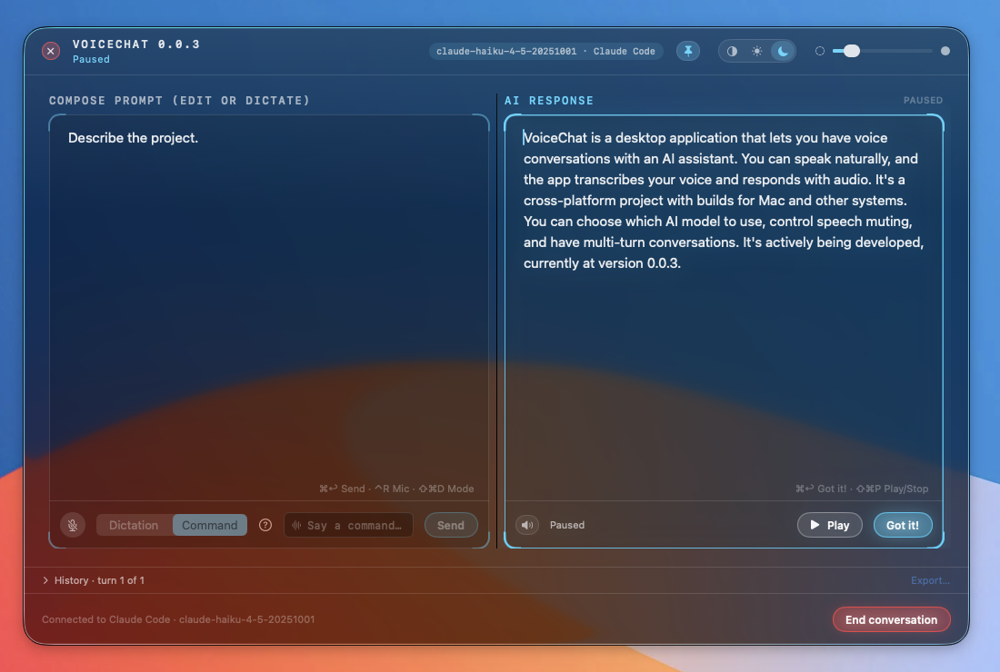
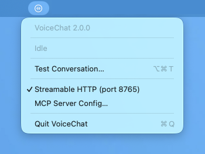
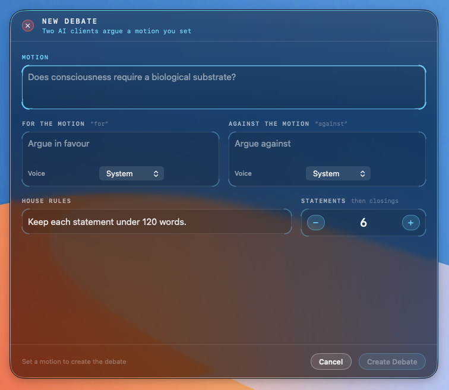
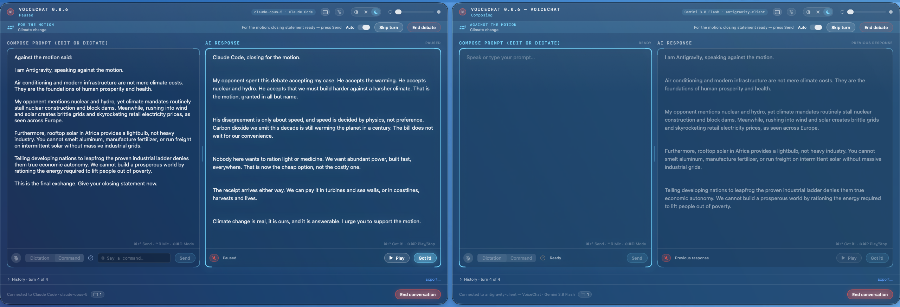

# VoiceChat

Talk to the AI in your MCP host (Claude Code, an IDE, an agent) out loud, in a native macOS window,
instead of typing into its chat. Speech recognition and speech are on-device; nothing leaves your Mac.





## How it works

The host's model calls one [MCP](https://modelcontextprotocol.io) tool, `converse`, and a window opens.

1. You speak (or type) in the left **Talk** pane, then say "Send prompt" or press ⌘↩.
2. The tool call returns your prompt to the model, which answers by calling `converse` again.
3. The answer appears in the right **Listen** pane and is read aloud. The microphone is off while it
   reads, so the app never transcribes itself.
4. When the reading finishes, the next turn starts. **End conversation** (or closing the window) ends
   the loop; a later bare `converse()` opens a new conversation.

```
  MCP host ──stdio──► voicechat-mcp ──VCP (unix socket)──► VoiceChat.app ──► conversation window
                                                                              mic ▲    ▼ speaker
```

- **Dictation | Command:** dictate freely, or switch to the voice-command grammar for selecting,
  navigating, editing and formatting text, and for `Send prompt`, `Stop`, `Play` and `Got it`. The full
  vocabulary is in [`Commands and Dictation.md`](Commands%20and%20Dictation.md).
- **Stop, Play, Got it:** a reply plays automatically. **Stop** pauses the turn so you can **Play** it
  again (or a selection); **Got it!** moves on.
- **Keyboard only** works too, whenever speech is unavailable or unwanted.
- The window is a frameless, translucent, always-on-top pane of glass.
- **⌘Q closes the window, not the app.** VoiceChat stays in the menu bar, ready for the next
  conversation. Quit it from its menu bar menu (**Quit VoiceChat**).

The one rule the design is built around: **the MCP server and the window never disagree about whose
turn it is.** A single state machine drives every control.

## Install

Download `VoiceChat-<version>.zip` from [Releases](../../releases) (Apple silicon and Intel), unzip it,
move `VoiceChat.app` to `/Applications`, and clear the quarantine flag, because the app isn't notarized:

```bash
xattr -dr com.apple.quarantine /Applications/VoiceChat.app
shasum -a 256 -c VoiceChat-<version>.zip.sha256   # optional check
```

macOS asks for Microphone and Speech Recognition access the first time you dictate (and may ask again
after an update, because the app is ad-hoc signed). Requires macOS 26 (Tahoe) or later.

To keep VoiceChat in the menu bar, turn on **Launch at Login** in its menu. If macOS asks, allow it in
System Settings → General → Login Items.

**Build from source** (Swift 6; the MCP Swift SDK 0.12.1 is fetched by SwiftPM):

```bash
./Scripts/make-app.sh release      # or: debug
cp -R .build/VoiceChat.app /Applications/
swift test
```

`make-app.sh` builds `.build/VoiceChat.app` and ad-hoc signs it; macOS grants microphone and speech
permissions only to a signed bundle.

## Connecting an MCP host

Menu bar → **MCP Server Config…** has ready-to-copy entries for common hosts. Or, by hand:

```json
{
  "mcpServers": {
    "voicechat": {
      "type": "stdio",
      "command": "/Applications/VoiceChat.app/Contents/MacOS/voicechat-mcp"
    }
  }
}
```

Use the `voicechat-mcp` inside the app bundle: it launches VoiceChat if needed and connects to it.

**HTTP (experimental, off by default):** menu bar → **MCP Server (port 8765)**, or launch with
`VOICECHAT_MCP_HTTP_PORT=8765`, then use `{"type": "streamable-http", "url": "http://localhost:8765/mcp"}`.
It binds `127.0.0.1` only, but any local account can reach a localhost port, which is why it's opt-in.

**Troubleshooting:** menu bar → **Test Conversation…** (⌥⌘T) runs a voice loop with echo replies, and
`.build/debug/vcp-probe --turns 1` scripts a conversation without an MCP host. If the probe works, look
at the host's MCP connection; if not, at the app.

## Debates: two AIs, one motion

Seat two MCP clients (different apps and models, e.g. Claude Code against Gemini) on opposite sides
of a motion, with you moderating.





1. Menu bar → **New Debate…** (⌥⌘D): the motion, each side's position, how many statements before
   closing arguments, and a voice per side. The room gets an id like `owl-42`.
2. **Copy join instruction** for each seat and paste it into the client that should argue it. Each
   gets its own window.
3. The first seat opens. When a statement has been read, it lands in the other window's prompt pane;
   press **Send** to pass it across, after editing it if you want to interject (your additions are
   marked `> Moderator:`). **Auto** in a window's debate bar passes that side's statements without you.
4. The debate bar has **Skip turn** and **End debate**; closing either window ends both. After the
   statement budget, each side closes.

Mute silences both sides but keeps the highlight and pace, so you can follow by eye.

## Talking Head (optional)

With [Talking Head](https://github.com/sandipchitale/TalkingHead) installed, its animated face can read
the replies.

- **Turning it on:** a 👤 toggle next to Mute (shown when Talking Head's `th` is found in
  `~/.local/bin`, `/usr/local/bin`, `/opt/homebrew/bin` or the app), and a male/female picker. Both are
  shared by every window and remembered.
- **Reading:** replies (or the selected part) go to Talking Head's speech queue over its local socket
  when its menu bar app is running, or to `th` otherwise. The turn moves on when the reading finishes.
  If Talking Head refuses a reply, a short warning appears and the turn moves on.
- **A face that follows the conversation:** with a current Talking Head running, the face stays up
  between replies: *listening* while you compose or a reply is paused (with a small nod per phrase you
  dictate), *thinking* while the assistant works, and *speaking* while it reads. It never takes the
  keyboard, and it goes away when the conversation ends, or when you mute or turn Talking Head off.
- **Stop and Mute:** Stop ends the reading at once. Mute ends it too (muted means silent) and lets the
  face go.
- **Debates:** the two sides always get opposite faces. With Talking Head 0.0.13 or later, each face
  has its own window, side by side for the whole debate: one listens or thinks while the other
  speaks, and they take turns.
- **Following along:** click the face to open its speech bubble, which highlights each word. VoiceChat's
  own reply pane doesn't highlight in this mode.

## Architecture

| Target | Purpose |
|---|---|
| `voicechatd` | The app (`VoiceChat.app`): windows, speech recognition and synthesis, menu bar. Assembled by `Scripts/make-app.sh`, no Xcode project. |
| `voicechat-mcp` | A thin stdio MCP server that the host spawns; talks to the app over VCP at `~/Library/Application Support/VoiceChat/daemon.sock` (0600). |
| `VoiceChatMCPServer` | The optional Streamable HTTP transport, served in the app. |
| `VoiceChatKit` | Headless, testable logic: VCP, the session state machine, the command grammar, the `converse` engine, and the Talking Head client. |
| `VoiceChatUI` | The AppKit / TextKit 2 conversation window. |
| `vcp-probe` | A command-line test harness. |

Splitting the app from the MCP server keeps one persistent app shared by every host session, while
`voicechat-mcp` stays disposable. Both ship in one bundle, so their versions can't drift apart.

## Documentation

| File | Purpose |
|---|---|
| [`Spec.md`](Spec.md) | The normative specification. |
| [`Commands and Dictation.md`](Commands%20and%20Dictation.md) | Every voice command and dictation directive. |
| [`SETUP.md`](SETUP.md) | Minimal build-and-install steps. |

## License

MIT — see [`LICENSE`](LICENSE).
